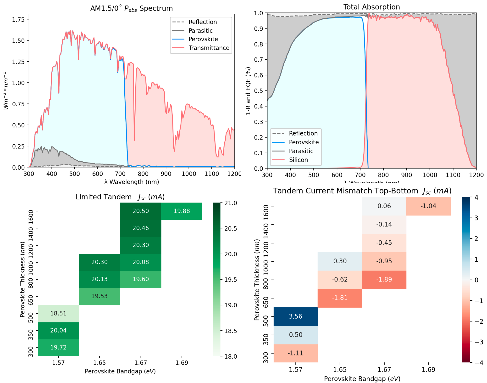

# op_sim
Optical Simulation of Metal Halide Perovskites

# Perovskite Automated Spin-Coating Assembly Line (PASCAL)

## Motivation

This repo is dedicated to FDTD (Lumerical), and SETFOS (TMM+RT), along with other tried methods to simulate/model the performance of MHP and MHP 2T tandems. 

### Demo of FDTD Results

