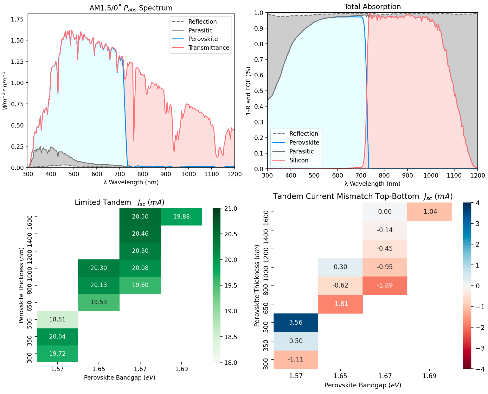

# op_sim
Optical Simulation of Metal Halide Perovskite Photovoltaics

## Motivation

This repo is dedicated to the pipeline design and operation of FDTD (Lumerical) and SETFOS (TMM+RT) softwares, along with standalone TMM to simulate/model the performance of metal halide perovskites (MHP) single junciton PV devices and MHP-Silicon 2T tandem devices. 

### Demo of FDTD Results

